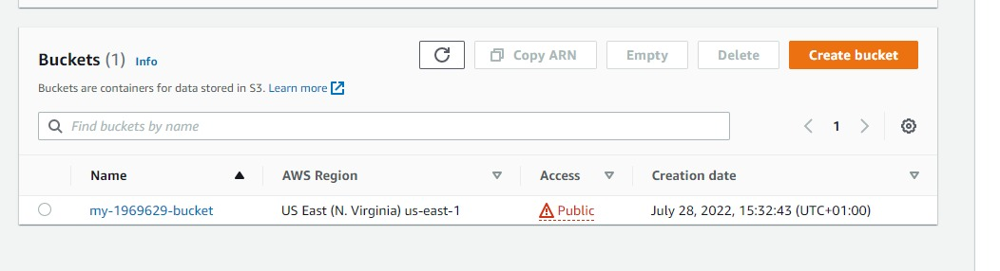
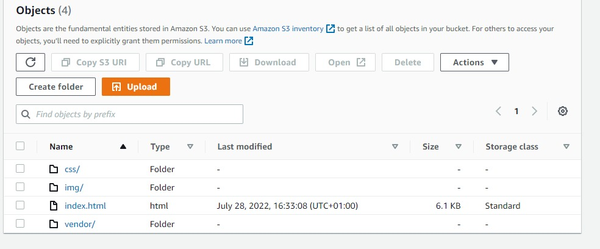
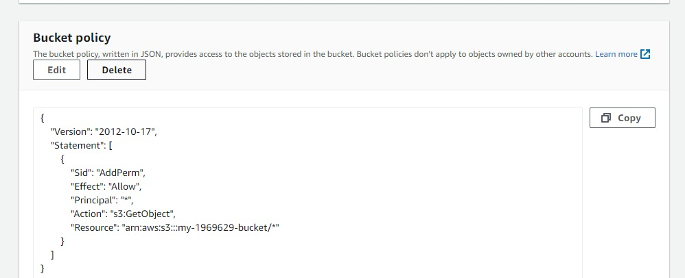
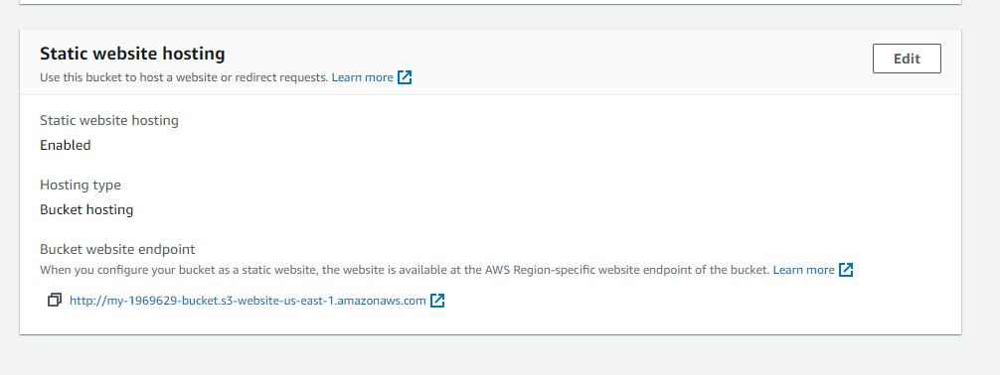
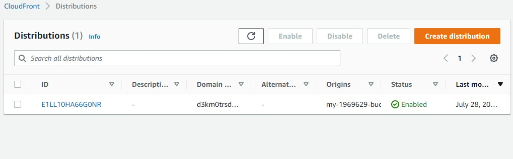

# -Deploy-Static-Website-on-AWS

The whole project has two major intentions to implement:

**  Hosting a static website on S3 and
**  Accessing the cached website pages using CloudFront content delivery network (CDN) service. Recall that CloudFront offers low latency and high transfer speeds during website rendering.
In this project, I deployed a static website to AWS by performing the following steps:

**  I created a public S3 bucket and upload the website files to your bucket.
**  I configured the bucket for website hosting and secure it using IAM policies.
**  I sped up content delivery using AWS’s content distribution network service, CloudFront.
**  I accessed my website in a browser using the unique CloudFront endpoint
## Steps
1. Created S3 bucket

2. Files uploaded

3. Securing bucket via IAM

4. Configuration of website hosting

5. Static website hosting enabled

## Access Points

1. Cloudfront domain:
https://d3km0trsd0k6qd.cloudfront.net

2.  Bucket website endpoint:

http://my-1969629-bucket.s3-website-us-east-1.amazonaws.com

N.B. This is one of the projects required for the completion of my udacity cloud devops nanodegree
